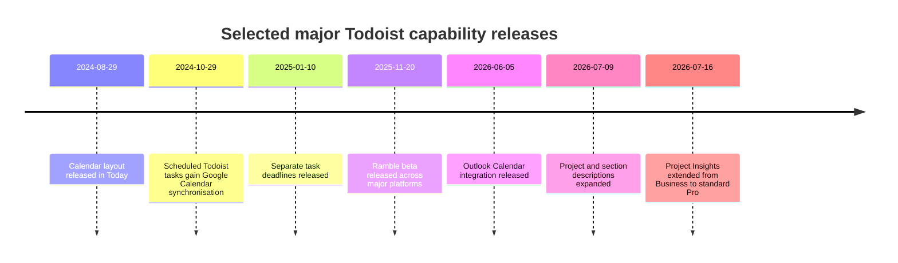

# Todoist Feature Inventory and Product Analysis

## Executive summary

As of **2 August 2026**, Todoist is best understood as a cross-platform personal task manager that has expanded into lightweight team work management, calendar-based planning, AI-assisted capture, project reporting and an extensible automation platform. Its strongest differentiator remains rapid task capture: typed natural-language Quick Add, keyboard-driven entry, browser and email capture, mobile widgets, voice entry through Ramble, and API or automation-based creation all feed the same task model. The resulting tasks can be organised with projects, sections, sub-tasks, labels, priorities, dates, deadlines, durations, reminders, assignments, comments and attachments. citeturn14search22turn15search20turn20view2turn19search11

Todoist’s current public plans are **Beginner**, **Pro** and **Business**. “Beginner” is the present official name for the free tier; “Personal” is not a separate current public plan, although Pro is the paid personal tier. Business supplies the principal team-administration capabilities. No public **Enterprise** plan, Enterprise price, SSO entitlement or SCIM entitlement was identified in Todoist’s current pricing, billing FAQ or public help catalogue; those items should therefore be treated as **unknown or not publicly specified**, rather than assumed to exist. citeturn16search9turn14search16turn20view0

The free tier is functionally useful rather than merely demonstrative: it includes task creation, projects, list and board layouts, labels, priorities, recurring dates, sub-tasks, sharing, comments, automatic reminders at task time, integrations, offline operation and calendar integration. The principal paid gates are the visual calendar layout and time-blocking, task durations, deadlines, custom and location reminders, substantially higher limits, full activity history, backups, most AI assistance, and Project Insights. Business adds a shared workspace, folders, higher team-project limits, membership and guest controls, roles, restricted projects, central billing and the most complete team-level Insights widgets. citeturn13view0turn16search2turn16search6turn17view2

Todoist is available through the web application, native macOS and Windows applications, iOS/iPadOS and Android applications, Chrome, Edge, Firefox and Safari browser extensions, and companion Apple Watch and Wear OS applications. Linux is also supported through a desktop application, although it was not one of the platforms requested for the matrix below. Browser extensions display a compact Todoist interface and add contextual webpage or selected-text capture, but some capabilities—notably Ramble and Safari right-click capture—are unavailable there. citeturn9search1turn19search3turn19search0turn19search1

The product now covers most requirements for personal planning and comparatively uncomplicated team workflows. It does **not** present itself as a full portfolio-management suite: no native Gantt/timeline planner, task dependency engine, resource-cost management, approval workflow or built-in running time tracker was found in the official feature and pricing catalogues. Time tracking is supplied through integrations such as Toggl Track and Clockify, while custom event-driven rules are supplied by third parties such as Doify, Zapier, IFTTT and Make or can be built with the API. This supports Todoist’s positioning as a deliberately lower-complexity system, but it is an important limitation for organisations needing formal project controls. citeturn11view0turn15search3turn15search0turn19search20turn12search4

The feature inventory below is “comprehensive” at the level of distinct user-facing capabilities. It excludes individual bug fixes, cosmetic changes, every API property and minor settings toggles. Where Todoist’s documentation does not expressly state a platform or plan, the matrix marks the item as unknown or inherited from the user’s account rather than inferring entitlement.

## Research scope and terminology

The research prioritised Todoist’s official feature pages, pricing pages, Help Centre, annual and weekly changelogs, integrations directory, developer documentation and official UI imagery. Third-party reviews were used principally to test the product-positioning conclusions and identify commonly reported gaps, rather than to establish feature entitlements. Todoist’s Help Centre was particularly important because the marketing feature page intentionally presents a simplified subset of the application. citeturn17view0turn14search20turn16search1turn17view4

The authenticated application at `app.todoist.com` does not expose a complete public feature inventory without an account and workspace context. Consequently, UI validation used Todoist’s public product screenshots, Help Centre walkthroughs and platform-specific illustrations. Those images show the production-style calendar, board, task-detail, Insights, template and collaboration interfaces, but plan-specific experiments may still vary by account, rollout cohort or application version. Todoist itself labels some functions as beta or experimental, including completed-task display in certain views. citeturn18view0turn18view1turn14search11

The following plan terminology is used throughout:

| Requested term | Current official equivalent | Interpretation |
|---|---|---|
| Free | **Beginner** | Free personal account; can also participate in or create a limited free team workspace. |
| Pro / Personal | **Pro** | Paid personal tier. “Personal” is treated as a descriptive category, not a current plan name. |
| Business / Teams | **Business** | Paid team tier. Some team collaboration is also available below Business with lower limits and fewer controls. |
| Enterprise | **Unknown / not publicly listed** | No separate public Enterprise tier was found in current official plan documents. SSO and SCIM were likewise not publicly documented. |

Todoist distinguishes a task’s **date** from its **deadline**. A date indicates when the user plans to work on or see the task; a deadline is the final completion boundary. Durations attach an expected amount of time to a scheduled task, while the paid calendar layout turns these fields into draggable time blocks. This distinction is central to Todoist’s recent planning model and prevents “work date” and “must-finish-by date” from being conflated. citeturn15search24turn21view1turn16search0

Plan prices in Todoist’s July 2026 billing FAQ are **US$7 per month or US$60 per year for Pro**, and **US$10 per member per month or US$8 per member per month billed annually for Business**. Todoist also advertises a seven-day Pro trial and a fourteen-day Business trial. Taxes, currency conversion and app-store billing can affect the amount ultimately charged. citeturn13view0turn16search9

## Feature architecture and UI

Todoist’s capabilities form six closely connected layers: capture; task structure; organisation and planning; collaboration; measurement; and external automation. The diagram represents a deduplicated conceptual model rather than Todoist’s menu hierarchy.

```mermaid
flowchart TD
    A[Todoist capability model]

    A --> C[Capture]
    C --> C1[Quick Add and natural language]
    C --> C2[Ramble voice capture]
    C --> C3[Browser, email and share-sheet capture]
    C --> C4[API and automation capture]

    A --> T[Task model]
    T --> T1[Name and description]
    T --> T2[Date, time, recurrence and deadline]
    T --> T3[Duration and reminders]
    T --> T4[Priority, labels and assignment]
    T --> T5[Sub-tasks, comments and attachments]

    A --> O[Organisation and planning]
    O --> O1[Inbox, projects and sections]
    O --> O2[Filters, search, sorting and grouping]
    O --> O3[List, board and calendar layouts]
    O --> O4[Today, Upcoming and templates]

    A --> L[Collaboration]
    L --> L1[Shared personal projects]
    L --> L2[Team workspaces and folders]
    L --> L3[Roles, guests and restricted projects]
    L --> L4[Mentions, notifications and activity]

    A --> M[Measurement]
    M --> M1[Karma, goals and streaks]
    M --> M2[Reporting and completed work]
    M --> M3[Project Insights and workload]

    A --> X[Integration and automation]
    X --> X1[Google and Outlook Calendar]
    X --> X2[Zapier, IFTTT, Make and Doify]
    X --> X3[REST and Sync APIs, SDKs and webhooks]
    X --> X4[CLI, MCP, URL schemes and Shortcuts]
```

The calendar layout illustrates Todoist’s move beyond a conventional checklist. Dated tasks can be displayed in day, week or month contexts, while timed tasks and durations form schedule blocks. Calendar events can appear beside those blocks when Google Calendar or Outlook Calendar is connected. Calendar events remain read-only in Todoist, whereas eligible Todoist tasks can be mirrored to the connected calendar. citeturn16search0turn16search2

*Official Todoist product image showing a project in monthly calendar layout. The calendar layout is a Pro and Business entitlement, while connecting Google or Outlook Calendar and displaying events is available across the current plans.* citeturn18view1turn16search2

Todoist’s newer Insights panel applies a lightweight project-intelligence layer to the underlying tasks. Depending on plan, it can display progress, completed work, at-risk signals, automatically calculated project health and assignment distribution. Project health is calculated from signals such as completed and overdue work, postponements, momentum and project or section descriptions; the Business-only assignment widget shows workload distribution, although it is not interactive on mobile. citeturn17view2

## Deduplicated feature catalogue

The table consolidates synonymous or overlapping documentation entries into distinct functional features. For example, “due dates”, “smart dates” and “natural-language dates” are represented as related aspects of date scheduling, while deadline is retained separately because it has different semantics and plan availability.

| Category | Feature | Concise description | Integrations, constraints or notable behaviour |
|---|---|---|---|
| Capture | Inbox | Default holding area for tasks not assigned to a project. | Available as a core view across primary applications. citeturn14search23 |
| Capture | Quick Add | Fast task-entry panel from which task attributes can be added without opening a project. | `Q` opens it in-app; desktop applications can invoke it globally while Todoist is minimised. citeturn20view2 |
| Capture | Natural-language parsing | Recognises dates, times and recurring expressions in typed task text. | Date expressions can be up to 150 characters; interpretation depends on the selected Todoist language. citeturn15search24turn7search0 |
| Capture | Quick Add attribute syntax | Inline tokens set project, section, assignee, label, priority, reminder or deadline. | `#`, `/`, `+`, `@`, `p1–p4`, `!` and `{date}` respectively. citeturn20view2 |
| Capture | Ramble | Converts free-form speech into one or more structured tasks. | Can extract names, descriptions, dates, projects, sections, priorities, labels, duration and paid deadlines; requires internet and is unavailable in browser extensions. Beginner receives ten sessions per month; paid plans are described as unlimited subject to rate limits. citeturn3search6turn15search14turn21view0 |
| Capture | Multi-task entry | Creates several tasks in one operation through repeated entry, pasted lines, voice extraction or template import. | Exact behaviour depends on platform; CSV import and Ramble provide bulk-oriented alternatives. citeturn14search5turn21view0 |
| Capture | Browser webpage capture | Saves the current webpage as a linked Todoist task. | Chrome, Edge and Firefox support contextual capture; Safari does not support the right-click command. citeturn19search3turn19search7 |
| Capture | Browser text capture | Saves selected webpage text as a linked task. | Documented for Chrome and Firefox-style extensions. citeturn19search7turn14search29 |
| Capture | Email-to-task add-ins | Turns Gmail or Outlook messages into tasks linked back to the email. | Gmail uses the general Chrome extension or Google Workspace add-on; the standalone Gmail Chrome extension was retired on 30 June 2026. Outlook supports Microsoft-hosted mail services and recent desktop or web Outlook versions. citeturn16search10turn16search12 |
| Capture | Email forwarding | Creates tasks or comments by forwarding messages to Todoist-generated email addresses. | Useful where no direct mail add-in exists; permissions and address secrecy must be managed carefully. citeturn16search12 |
| Capture | Mobile dynamic add | Draggable mobile add button inserts tasks, sections or sub-tasks at a chosen position. | Mobile-specific interface on iOS and Android. citeturn19search9 |
| Task model | Task name | Primary actionable title, supporting links and formatting conventions. | Limit documented as 500 characters. citeturn20view1 |
| Task model | Task description | Long-form context, notes and links attached to a task. | Limit documented as 16,383 characters. citeturn20view1turn15search20 |
| Task model | Task view | Unified detail panel for description, scheduling, deadline, priority, labels, comments, files, reminders and sub-tasks. | Available on primary applications; placement differs between desktop and mobile. citeturn15search20 |
| Scheduling | Date and time | Indicates when a task should appear or be worked on. | Supports natural-language entry and manual scheduling. citeturn15search24 |
| Scheduling | Recurring dates | Automatically advances a task after completion according to a recurrence rule. | Supports fixed-calendar recurrence and completion-relative `every!` recurrence. Complex mixed-time patterns can require multiple tasks. citeturn15search11turn8search8 |
| Scheduling | Deadline | Separate hard completion boundary in addition to the working date. | Paid feature introduced in January 2025; Quick Add syntax uses braces, for example `{30 September}`. citeturn21view1turn20view2 |
| Scheduling | Task duration | Records the expected length of scheduled work. | Paid feature; used for calendar blocks and time blocking. It is not an elapsed-time tracker. citeturn16search6turn16search0 |
| Scheduling | Automatic reminder | Notification at the task’s scheduled time. | Included across current plans when a task has an applicable time. citeturn13view0turn14search21 |
| Scheduling | Custom timed reminder | User-selected notification before or at another time. | Pro and Business. citeturn13view0turn14search21 |
| Scheduling | Recurring reminder | Reminder that follows a repeated notification pattern. | Pro and Business. citeturn13view0 |
| Scheduling | Location reminder | Notification on arriving at or leaving a stored location. | Pro and Business; mobile device location permissions are required. citeturn14search21turn13view0 |
| Structure | Projects | Containers for related tasks, with names, colours, layouts and optional descriptions. | Personal and team projects use different ownership and permission models. citeturn14search12turn5search1 |
| Structure | Sub-projects | Nested organisation for personal projects. | Team workspaces use folders rather than personal-project nesting as the principal higher-level grouping method. citeturn15search5 |
| Structure | Project and section descriptions | Adds objectives, context, links or instructions above a project or section. | Added in 2026; descriptions also contribute signals to Business project-health calculations. citeturn5search1turn17view2 |
| Structure | Sections | Divides a project into phases, categories or board columns. | General limit: 20 sections per project. citeturn14search22turn20view1 |
| Structure | Sub-tasks | Breaks a task into independently schedulable and assignable steps. | Up to four indentation levels; sub-tasks remain in the parent’s project, and re-indenting is restricted in automatically sorted views. citeturn7search15turn15search18 |
| Structure | Labels | Cross-project tags for contexts, categories or workflow states. | Up to 500 labels per account and 100 labels per task. citeturn15search7turn20view1 |
| Structure | Priorities | Four urgency levels, visually distinguishing important work. | Quick Add uses `p1` through `p4`; API numeric direction is reversed, with client `p1` represented as API priority `4`. citeturn20view2turn17view4 |
| Structure | Favourites | Pins frequently used projects, labels or filters for faster navigation. | Can be ordered in the sidebar. citeturn6search6turn14search17 |
| Views | Today | Focused view of due and overdue work for the current day. | Supports list, board and paid calendar presentation; connected calendar events can appear here. citeturn14search22turn16search2 |
| Views | Upcoming | Forward-looking schedule for future tasks. | Supports date navigation, planning and paid calendar layouts; connected events also appear here. citeturn14search22turn16search2 |
| Views | List layout | Conventional vertical task list. | Included on all current plans. citeturn13view0turn14search22 |
| Views | Board layout | Kanban-style columns, normally based on sections or grouping. | Included on all current plans; tasks can be dragged between columns. citeturn0search11turn13view0 |
| Views | Calendar layout | Day, week or month-oriented task visualisation and time blocking. | Pro and Business. Coverage differs by view and device; Today calendar was initially web and desktop before broader mobile refinement. citeturn16search0turn17view1 |
| Views | Sorting | Orders tasks by fields such as date, priority, label or assignee. | Automatic sorting can disable manual reordering. citeturn1view3turn7search15 |
| Views | Grouping | Divides a view by project, section, date, assignee, priority, label or other supported criteria. | Available through view options; exact criteria vary by view. citeturn0search7turn17view4 |
| Discovery | Search and Quick Find | Locates tasks, projects, labels, filters, comments and commands. | `/` or `F` commonly opens search; `Ctrl/Cmd+K` opens Quick Find. citeturn1view2turn20view2 |
| Discovery | Filters | Saved query-based views combining dates, text, projects, labels, priorities, creation dates and Boolean conditions. | Beginner: three; Pro and Business: 150 per member. Only documented filter syntax is guaranteed. citeturn15search7turn13view0turn7search13 |
| History | Completed tasks | Stores and exposes completed work for review, search or restoration. | Completed-task display in Today and Upcoming has had experimental or platform-specific status; Reporting is the more complete historical surface. citeturn14search11 |
| History | Reporting and activity log | Records task and comment creation, edits, completion, deletion and other supported events. | Beginner history is limited to seven days; paid plans receive full history. Filters include project, person, action, workspace and date range; loaded activity can be exported as Markdown. citeturn20view4 |
| Productivity | Karma | Points, levels and streak-oriented motivation based on task completion and goal behaviour. | Can be disabled; vacation mode protects streak expectations during planned absence. citeturn14search4turn14search20 |
| Productivity | Daily and weekly goals | User-defined target numbers of completed tasks. | Default goals are five daily and 25 weekly, but users can change them. citeturn14search8 |
| Productivity | Productivity view | Displays completed-task totals, progress towards goals, Karma and trends. | Available on desktop and mobile, with some widget detail reserved for paid accounts. citeturn14search8turn19search5 |
| Productivity | Project Insights | Automatic project-progress, at-risk and completed-work widgets. | Pro and Business; Business adds health and assignment-distribution widgets. Guests cannot access Business Insights. citeturn17view2turn21view4 |
| Reuse | Official templates | Pre-built project structures for work and personal use. | Searchable template gallery available across major platforms. citeturn15search31turn20view3 |
| Reuse | Custom templates | Saves an existing project’s structure for later reuse. | Can preserve descriptions, comments and assignments; recipients must already have access to assignees. citeturn20view3 |
| Reuse | Team-shared templates | Makes a template discoverable to members of a team workspace. | Team functionality; public documentation associates shared workspace templates most clearly with Business. citeturn14search9turn13view0 |
| Data portability | CSV project import and export | Transfers or duplicates a project through a structured CSV file. | Export can include tasks, descriptions, sections, dates, comments and attachments; upload is computer-only, after which templates can be used on any device. citeturn14search5turn20view3 |
| Resilience | Automatic backups | Creates downloadable daily project backups. | Pro and Business; restoration is principally performed on web or desktop using CSV files. citeturn3search10turn17view3 |
| Collaboration | Shared personal projects | Invites other users into a personal project. | Available across plans, subject to member and guest limits. citeturn6search3turn15search17 |
| Collaboration | Task assignment | Assigns responsibility for a shared-project task. | One primary assignee per task; use separate sub-tasks for multi-person work. citeturn6search26turn15search18 |
| Collaboration | Comments | Conversation thread attached to a task or project. | Supports text and links; project comments have a dedicated `c` shortcut in current desktop/web builds. citeturn1view1turn19search13 |
| Collaboration | File and voice-note comments | Adds documents, images or recorded audio to discussion. | One file attachment per comment; size caps vary by plan. citeturn1view1turn20view1turn13view0 |
| Collaboration | Mentions | Uses `@name` in comments to direct a notification to a collaborator. | Requires project access; delivery depends on notification settings. citeturn6search3turn15search9 |
| Collaboration | Collaboration notifications | Email or push notifications for assignments, comments, mentions, project invitations and other shared activity. | Users can customise notification channels by activity type. citeturn14search14turn15search9 |
| Teams | Team workspace | Shared organisational area separated from private personal projects. | Core team collaboration can be used with lower limits below Business; Business supplies full paid team limits and controls. citeturn1view1turn13view0 |
| Teams | Team projects | Workspace-owned projects visible to or restricted from team members according to access settings. | Business supports up to 500 team projects; lower plans have a much smaller free-team allowance. citeturn13view0 |
| Teams | Folders | Groups related team projects by department, client or initiative. | Business-oriented workspace feature; analogous to, but distinct from, personal sub-projects. citeturn15search5turn13view0 |
| Teams | Roles | Differentiates administrators, members and guests. | Business permits meaningful role control; in a free team, invited users may receive administrator-level status by default. citeturn6search2turn6search8 |
| Teams | Restricted projects | Limits a team project to expressly selected members. | Business administration and privacy feature. citeturn6search10 |
| Teams | People tab | Shows team membership, roles, invitations and workload-oriented task views. | Team members and admins can inspect the team; functionality expanded alongside Insights and Reporting in 2026. citeturn6search16turn21view4 |
| Teams | Workspace overview | Summarises team projects, progress and health in one place. | Most complete in Business; Pro’s My Projects overview offers a smaller progress summary. citeturn17view2 |
| Teams | Centralised billing | One subscription and payment administration surface for the workspace. | Business. citeturn13view0 |
| Calendar | Google Calendar integration | Displays Google events in Todoist and mirrors scheduled tasks into a Todoist calendar. | Available on all current plans; calendar layout remains paid. Events are read-only in Todoist. citeturn16search2 |
| Calendar | Outlook Calendar integration | Equivalent event display and scheduled-task synchronisation for Outlook. | Available on all current plans; organisation administrators may need to approve the Microsoft OAuth application. citeturn16search2turn16search8 |
| Calendar | Calendar visibility controls | Shows or hides individual calendars from the connected account. | Only one calendar provider/account can be directly connected at a time, although subscribed calendars can broaden the visible set. citeturn16search2 |
| Calendar | iCalendar feed | Publishes account or project tasks to Apple Calendar, Google Calendar, Outlook or another feed consumer. | One-way; refresh frequency is controlled by the calendar client. Only the first seven future occurrences of recurring tasks may initially appear. Android cannot copy a project feed directly from the native app. citeturn16search5 |
| Integrations | Integration gallery | Catalogue covering calendars, email, messaging, browsers, automation, time tracking, AI, notes and productivity tools. | Todoist advertises more than 90 integrations and additional connections through automation partners. citeturn11view0turn2view2 |
| Integrations | Gmail integration | Creates linked Todoist tasks from Gmail web, iOS or Android. | Google Workspace add-on supports Gmail mobile; the Chrome extension supports Chromium desktop. Email links generally open in Gmail web. citeturn16search10turn9search14 |
| Integrations | Outlook Mail integration | Creates linked tasks from supported Outlook messages. | Paid accounts can additionally use certain AI-assisted summarisation and action-item extraction capabilities. citeturn16search12turn6search17 |
| Integrations | Communication integrations | Connects Todoist with tools such as Slack and Microsoft Teams for task creation or notifications. | Exact commands and plan requirements depend on the external service. citeturn11view0 |
| Integrations | Note and project-tool integrations | Links or embeds Todoist with products such as Notion, Trello and Evernote-oriented workflows. | Notion embedding is most reliable in a web browser; Trello’s Power-Up creates tasks from cards. citeturn14search15turn15search12 |
| Integrations | Third-party time tracking | Adds timers to tasks through tools such as Toggl Track or Clockify. | Toggl’s documented integration operates in Todoist’s web app through Chrome, Firefox or Edge, not native desktop or mobile applications. citeturn19search20turn9search8 |
| Automation | Zapier | Trigger-and-action workflows between Todoist and external applications. | Examples include archiving completed tasks, creating calendar events and receiving tasks from other work systems. Todoist’s older help copy says “over 500” connected apps; Zapier’s present catalogue may be larger, so the official quoted number should be treated as a minimum rather than a current total. citeturn15search0 |
| Automation | IFTTT | Applets connecting Todoist events with consumer services and devices. | Examples include logging completed tasks in Google Sheets or creating a task from an assigned GitHub issue. citeturn15search16 |
| Automation | Make and Power Automate pathways | Constructs multi-step integrations where direct native support is unavailable. | Referenced by Todoist for services such as OneNote; capability and pricing are governed by the automation provider. citeturn15search8 |
| Automation | Doify rules | Third-party Todoist-specific custom rules combining a trigger and an action. | Supplies rule-based behaviour that is not presented as a native Todoist rules engine. citeturn15search3 |
| Automation | REST and Sync APIs | Programmatic reading and modification of Todoist resources. | API use is free, but authenticated-account plan restrictions continue to apply. `/sync` supports efficient local synchronisation and some operations not exposed through ordinary REST endpoints. citeturn17view4 |
| Automation | Official SDKs | Python and TypeScript libraries for the Todoist API. | Maintained through Doist-hosted documentation and standard package registries. citeturn17view4 |
| Automation | OAuth and API tokens | Authorises third-party applications or personal scripts. | Issuing a new API token invalidates prior active sessions and is part of Todoist’s account-recovery guidance. citeturn17view3turn17view4 |
| Automation | Webhooks | Delivers supported account or workspace events to integrations. | Developer capability; event coverage and retry behaviour should be checked against the current API reference before implementation. citeturn17view4 |
| Automation | CLI and URL schemes | Command-line and deep-link interfaces for opening views or pre-filling actions. | Official developer material documents CLI tooling and Todoist URL schemes; desktop global capture complements them. citeturn10search1turn20view2 |
| Automation | MCP and AI connectors | Lets compatible AI clients read or update tasks and projects through Todoist’s hosted connector. | Official documentation references MCP use with products including Claude, ChatGPT, Cursor and VS Code; OAuth grants should be reviewed like any third-party integration. citeturn10search1turn16search14 |
| Automation | Apple Shortcuts | Creates tasks or chains Todoist actions into personal automations. | Supports parameters including date, project, priority and labels; can be triggered through Siri, Share Sheet, widgets or Shortcuts automations. Apple may open Todoist while running an action. citeturn19search4 |
| Platform | Desktop global Quick Add | Invokes task capture while another application is active. | Default: `Option+Space` on macOS and `Ctrl+Space` on Windows; customisable. Global shortcuts are not supported on Linux. citeturn20view2 |
| Platform | Desktop multi-window | Opens additional Todoist windows and can keep a window floating above others. | Native desktop feature with dedicated keyboard shortcuts. citeturn19search2 |
| Platform | Mobile and desktop widgets | Displays task lists, progress or add-task controls outside the main app. | iOS/iPadOS, Android and recent macOS versions; widget types and interaction differ by OS. citeturn19search5turn19search12 |
| Platform | Apple Watch application | Adds, views, reschedules and completes tasks; supplies watch-face complications. | Must remain within update range of the paired Apple device for changes to synchronise. citeturn19search0 |
| Platform | Wear OS application | Standalone watch application for Inbox, Today, Upcoming, favourites, task creation, sub-tasks and completion. | Unlike the older Android Wear implementation, it can sign in independently of a phone. citeturn19search1 |
| Platform | Android launcher shortcuts | Direct shortcuts to add, search, Today, Upcoming, projects, labels and filters. | Requires Android 7.1 or later. citeturn19search21 |
| Reliability | Offline mode | Automatically permits local work without a network and syncs changes after reconnection. | The user must already be logged in, and web or desktop Todoist should have been launched before losing connectivity. Browser storage must remain enabled. citeturn20view5turn15search10 |
| Reliability | Cross-device synchronisation | Propagates tasks, projects, settings and shared changes among connected applications. | Unsynchronised local data can be lost if browser storage is cleared before reconnection. citeturn15search6turn15search21 |
| AI | Task Assist | Suggests next tasks, rewrites a task more actionably, breaks work into sub-tasks and generates execution tips. | Paid feature under the current pricing comparison; suggestions still require user review. citeturn4search5turn13view0 |
| AI | Email Assist | Summarises an email or extracts action items into Todoist tasks or sub-tasks. | Paid and integration-dependent; documented most directly in Outlook Mail material. citeturn4search15turn6search17 |
| AI | Capture from text, images and documents | Extracts tasks from supplied unstructured content. | Paid entitlement according to the plan FAQ; exact UI and supported formats may vary during rollout. citeturn13view0 |
| AI | AI-generated template description | Drafts a description when saving a project as a template. | Documented output languages are English or Spanish. citeturn20view3 |

## Platform and plan matrix

### Interpretation

In the following matrix, **✓** means officially documented availability, **≈** means available in a reduced, inherited or context-dependent form, **—** means expressly unavailable or inapplicable, and **?** means Todoist does not publicly specify the combination. “Ext” means the Chrome, Edge, Firefox or Safari extension family. Browser extensions inherit account plan permissions through their compact Todoist view, but extension-specific hardware or contextual functions can differ by browser. citeturn19search3

Plan abbreviations are **B** for Beginner, **P** for Pro and **Bu** for Business. The Enterprise column is not included as an entitlement because no separate current public plan was identified. Features marked “All” apply to B, P and Bu unless a usage limit differs.

| Feature or feature group | Web | iOS | Android | macOS | Windows | Ext | Beginner | Pro | Business |
|---|:---:|:---:|:---:|:---:|:---:|:---:|:---:|:---:|:---:|
| Core task creation, editing and completion | ✓ | ✓ | ✓ | ✓ | ✓ | ✓ | ✓ | ✓ | ✓ |
| Inbox, Today, Upcoming and project views | ✓ | ✓ | ✓ | ✓ | ✓ | ✓ | ✓ | ✓ | ✓ |
| Natural-language Quick Add | ✓ | ✓ | ✓ | ✓ | ✓ | ✓ | ✓ | ✓ | ✓ |
| Ramble voice capture | ✓ | ✓ | ✓ | ✓ | ✓ | — | 10 sessions/month | ✓, rate-limited | ✓, rate-limited |
| Projects and sections | ✓ | ✓ | ✓ | ✓ | ✓ | ✓ | Limited counts | Higher counts | Highest team counts |
| Labels and priorities | ✓ | ✓ | ✓ | ✓ | ✓ | ✓ | ✓ | ✓ | ✓ |
| Dates, times and recurring dates | ✓ | ✓ | ✓ | ✓ | ✓ | ✓ | ✓ | ✓ | ✓ |
| Deadline field | ✓ | ✓ | ✓ | ✓ | ✓ | ≈ | — | ✓ | ✓ |
| Task duration | ✓ | ✓ | ✓ | ✓ | ✓ | ≈ | — | ✓ | ✓ |
| Automatic reminder at task time | ✓ | ✓ | ✓ | ✓ | ✓ | ≈ | ✓ | ✓ | ✓ |
| Custom, recurring and location reminders | ✓ | ✓ | ✓ | ✓ | ✓ | ≈ | — | ✓ | ✓ |
| Sub-tasks | ✓ | ✓ | ✓ | ✓ | ✓ | ✓ | ✓ | ✓ | ✓ |
| List layout | ✓ | ✓ | ✓ | ✓ | ✓ | ✓ | ✓ | ✓ | ✓ |
| Board layout | ✓ | ✓ | ✓ | ✓ | ✓ | ≈ | ✓ | ✓ | ✓ |
| Calendar layout and time blocking | ✓ | ✓ | ✓ | ✓ | ✓ | ≈ | — | ✓ | ✓ |
| Connected Google or Outlook events | ✓ | ✓ | ✓ | ✓ | ✓ | ? | ✓ | ✓ | ✓ |
| Task-to-calendar sync | ✓ | ✓ | ✓ | ✓ | ✓ | ? | ✓ | ✓ | ✓ |
| Filters | ✓ | ✓ | ✓ | ✓ | ✓ | ✓ | 3 | 150 | 150/member |
| Search and Quick Find | ✓ | ✓ | ✓ | ✓ | ✓ | ✓ | ✓ | ✓ | ✓ |
| Templates gallery | ✓ | ✓ | ✓ | ✓ | ✓ | ≈ | ✓ | ✓ | ✓ |
| Create custom template | ✓ | ✓ | ✓ | ✓ | ✓ | ? | ✓ | ✓ | ✓ |
| CSV upload/export | ✓ | —/≈ | —/≈ | ✓ | ✓ | — | ✓ | ✓ | ✓ |
| Shared personal projects | ✓ | ✓ | ✓ | ✓ | ✓ | ✓ | ✓ | ✓ | ✓ |
| Assignment, comments and mentions | ✓ | ✓ | ✓ | ✓ | ✓ | ✓ | ✓ | ✓ | ✓ |
| Reporting history | ✓ | ✓ | ✓ | ✓ | ✓ | ≈ | 7 days | Full | Full |
| Automatic daily backups | ✓ download | ≈ | ≈ | ✓ | ✓ | — | — | ✓ | ✓ |
| Karma and goals | ✓ | ✓ | ✓ | ✓ | ✓ | ≈ | ✓ | ✓ | ✓ |
| Project Insights | ✓ | ✓ | ✓ | ✓ | ✓ | ? | — | Core widgets | Full widgets |
| Team workspace | ✓ | ✓ | ✓ | ✓ | ✓ | ≈ | Limited free team | Limited free team | ✓ |
| Team folders | ✓ | ✓ | ✓ | ✓ | ✓ | ≈ | ? / limited | ? / limited | ✓ |
| Roles, restricted projects and central billing | ✓ | ✓ | ✓ | ✓ | ✓ | ≈ | — / rudimentary | — / rudimentary | ✓ |
| Shared team templates | ✓ | ✓ | ✓ | ✓ | ✓ | ? | ? | ? | ✓ |
| Browser webpage/text capture | N/A | N/A | N/A | N/A | N/A | ✓ | ✓ | ✓ | ✓ |
| Global Quick Add while app is minimised | — | — | — | ✓ | ✓ | — | ✓ | ✓ | ✓ |
| Desktop multi-window and always-on-top | — | — | — | ✓ | ✓ | — | ✓ | ✓ | ✓ |
| Widgets | — | ✓ | ✓ | ✓ on macOS 14+ | — | — | ✓ | Enhanced trends | Enhanced trends |
| Apple Shortcuts and Siri task workflows | — | ✓ | — | ≈ widgets only; direct Siri limitation | — | — | ✓ | ✓ | ✓ |
| Apple Watch companion | — | Through iPhone | — | — | — | — | ✓ | ✓ | ✓ |
| Wear OS standalone app | — | — | ✓ ecosystem | — | — | — | ✓ | ✓ | ✓ |
| Offline task work | ✓ | ✓ | ✓ | ✓ | ✓ | ≈ through compact web storage | ✓ | ✓ | ✓ |
| REST/Sync API and SDK access | ✓ API | ✓ via services | ✓ via services | ✓ API | ✓ API | — | ✓, plan limits apply | ✓ | ✓ |
| Zapier, IFTTT and other automation | Cloud service | Cloud service | Cloud service | Cloud service | Cloud service | N/A | ✓ subject to provider | ✓ | ✓ |
| Task Assist, Email Assist and content extraction | ✓ | ✓/≈ | ✓/≈ | ✓ | ✓ | ? | — | ✓ | ✓ |

The matrix is supported by Todoist’s feature, pricing, platform and integration documentation. Individual rollouts can require a minimum mobile application version; for example, the July 2026 Insights documentation requires at least Android 12070 or iOS 26.3.13. Browser-extension compact mode claims access to the broader Todoist interface, but microphone access and browser context commands remain extension-specific. citeturn17view2turn19search3turn16search9

### Plan limits with material pricing impact

| Limit or entitlement | Beginner | Pro | Business |
|---|---:|---:|---:|
| Personal projects | 5 | 300 | 300 per member |
| Team projects | 5 | 5 | 500 |
| Filters | 3 | 150 | 150 per member |
| Activity history | 7 days | Full | Full |
| Daily automatic backups | No | Yes | Yes |
| File upload per comment | 5 MB | 25 MB in the July 2026 FAQ | 100 MB |
| Calendar layout | No | Yes | Yes |
| Deadlines and durations | No | Yes | Yes |
| Project Insights | No | Yes, excluding Pro Legacy | Yes |
| Custom/location/recurring reminders | No | Yes | Yes |
| Ramble | 10 sessions per month | Unlimited subject to rate limits | Unlimited subject to rate limits |

These figures come from the current billing FAQ rather than older marketing copy. Todoist’s public pages have not always been perfectly synchronised: at least one pricing-page rendering has shown a different Pro attachment figure, while the more recently updated July 2026 FAQ specifies **25 MB**. For procurement or compliance purposes, the account’s live billing interface and contract should take precedence over a cached marketing page. citeturn13view0turn16search9

The **Pro Legacy** tier is a special grandfathered arrangement, not the standard current Pro offering. It preserves its earlier price and the paid feature set available through 10 December 2025, but excludes paid capabilities launched later, including Pro access to Insights and certain newer AI features. Moving to standard Pro adopts the regular US$7 monthly or US$60 annual price. citeturn16search7turn21view4

## Automation, collaboration, security and operating characteristics

### Keyboard and command surface

Todoist has one of the more extensive keyboard systems among mainstream task applications. The most consequential shortcuts are summarised below; the exact key can differ by operating system and keyboard layout.

| Action | Shortcut or syntax |
|---|---|
| Open Quick Add inside Todoist | `Q` |
| Search | `/` or `F` |
| Quick Find / command navigation | `Ctrl/Cmd + K` |
| Toggle sidebar | `M` |
| Show shortcut reference | `?` |
| Complete selected task | `E` |
| Edit task | `Ctrl/Cmd + E` |
| Schedule a task | `T` |
| Remove task date | `Shift + T` |
| Set priority | `1`, `2`, `3`, `4`, or `p1`–`p4` in Quick Add |
| Add bottom/top task | `A` / `Shift + A` |
| Indent/outdent a sub-task | `Ctrl + ]` / `Ctrl + [` |
| Select project in Quick Add | `#` |
| Select section | `/` |
| Add label | `@` |
| Add assignee | `+` |
| Add reminder | `!` |
| Add deadline | `{date}` |
| macOS global Quick Add | `Option + Space` |
| Windows global Quick Add | `Ctrl + Space` |
| macOS global Ramble, new installs | `Option + Shift + R` |
| Windows global Ramble, new installs | `Alt + Shift + R` |
| Open Project Insights | `i` |
| Open task or project comments | `c`, in supported context |
| Navigate to Inbox / Today / Upcoming | `G`, then `I` / `T` / `U` |

Global shortcuts work while the desktop application is minimised and can be customised. Global Quick Add and Ramble are not supported on Linux. Todoist warns that some shortcuts are designed around QWERTY and QWERTZ layouts and may not work identically on other keyboard layouts. citeturn20view2turn1view2turn21view4turn19search13

### Automation model

Todoist does not publicly document a first-party, no-code rules builder equivalent to the automation engines in some heavier project-management products. Instead, automation is deliberately layered:

1. **Native deterministic automation** comes from recurring dates, reminders, calendar synchronisation, templates, natural-language parsing and mobile Shortcuts.
2. **Partner automation** comes from Zapier, IFTTT, Make, Power Automate, TaskClone and Todoist-focused tools such as Doify.
3. **Developer automation** comes from REST and Sync APIs, official Python and TypeScript SDKs, OAuth, tokens, webhooks, URL schemes, command-line tools and the hosted MCP endpoint.
4. **AI assistance** comes from Ramble, Task Assist, Email Assist, document or image extraction, template-description generation and AI connectors. citeturn15search0turn15search16turn15search3turn17view4turn10search1

This architecture is flexible but decentralised. A user can automate nearly any ordinary task or project operation, yet sophisticated event logic may depend on another paid service and therefore introduce an additional vendor, permission boundary, failure mode and subscription cost. Todoist also excludes integrations that depend solely on Zapier or IFTTT from its direct integration-gallery listing process, meaning the official gallery is not a complete inventory of possible connections. citeturn14search7turn15search23

The API is free to call, although it enforces the authenticated user’s Todoist plan and object limits. Todoist exposes a conventional REST interface and a specialised `/sync` endpoint used by its own clients. Official clients make optimistic local updates, which can temporarily create `tmp-` resource identifiers; integrations must wait for the server-assigned identifier before using ordinary REST calls. This is relevant to any automation triggered immediately after local task creation. citeturn17view4

### Collaboration and team governance

Todoist supports two collaboration models. A personal project can be shared with selected collaborators for household, freelance or small-group work. A team workspace provides organisation-owned projects, a member directory, folders, workspace visibility, roles and consolidated billing. Team-owned data remains with the team workspace, while personal projects remain private unless shared. citeturn15search17turn6search25

Within shared work, collaborators can assign tasks, assign sub-tasks independently, discuss work through comments, mention teammates, attach files or voice notes and inspect task, project or account-level activity. A task has only one assignee, which preserves clear accountability but means genuinely joint work must be represented using sub-tasks, duplicate tasks or mentions. Reporting can filter activity by collaborator and event and identifies whether an action originated from mobile, desktop, web or an integration. citeturn6search26turn15search18turn20view4

Business governance includes administrators, members and guests; restricted projects; team folders; a People tab; project-discovery and joining controls; central billing; and controls relating to team discovery, linked domains and external guests. Free-team governance is materially weaker: official documentation indicates that people invited into a free team may be administrators by default, which is a significant consideration for organisations experimenting with Todoist before buying Business. citeturn6search2turn6search8turn6search10turn6search19

Insights adds operational visibility without requiring members to submit manual status reports. The Pro implementation provides project-level at-risk, progress and completed-work views. Business adds automatically calculated project health, assignment distribution and workspace-wide health summaries. This is valuable for lightweight oversight, but it is not equivalent to capacity planning: it counts assigned active tasks rather than modelling hours, skills, cost rates or formal utilisation. citeturn17view2turn21view4

### Offline and synchronisation

Offline mode activates automatically. Users can create and modify tasks while disconnected, and Todoist synchronises the local changes after connectivity returns. The user must have logged in previously, and the web or desktop app must have been launched before going offline. The desktop global Quick Add also works offline. citeturn20view5turn15search15

Offline support does not make every capability network-independent. Ramble requires an internet connection; inviting collaborators requires connectivity; calendar events and third-party integrations require their remote services; and account login cannot be completed offline. On the web, local changes depend on browser storage, so clearing site data before synchronisation can destroy unsent changes. citeturn15search14turn15search13turn15search10turn15search6

### Security, privacy and administration

Todoist states that data is protected with TLS while in transit and encryption at rest in its cloud infrastructure. It supports two-factor authentication using an authenticator application and recovery codes, checks credentials against the Have I Been Pwned breach corpus during login, permits account and data deletion, and allows a token reset that logs the account out of active sessions. Todoist also points customers to its Trust Centre for current security and compliance material. citeturn5search0turn6search0turn17view3

The public pricing and team-security material refers to SOC 2 compliance or certification, GDPR-related obligations, role and permission controls, restricted projects, external-guest restrictions and domain-oriented team discovery. These are meaningful organisational controls, but they should not be interpreted as a documented Enterprise identity stack. The reviewed public sources did not specify SAML SSO, SCIM provisioning, customer-managed encryption keys, data-loss-prevention policies, legal holds or region-selectable data residency. Their status is therefore **unknown from public Todoist documentation**, not necessarily technically impossible or contractually unavailable. citeturn15search22turn5search0turn6search19

Todoist does not describe task content as end-to-end encrypted. Encryption at rest means the storage layer is encrypted, but it does not imply that only the user holds decryption keys. Organisations handling highly regulated or secret information should review the Trust Centre, data-processing terms, sub-processors, retention practices and any negotiated Business agreement rather than relying solely on the public feature page. citeturn5search0turn17view3

Calendar privacy has a specific design: Todoist says connected Google or Outlook events are not stored as ordinary events in the Todoist database; it stores calendar references required to select and display them. Calendar events visible in Today or Upcoming are private to the connected user and are not automatically exposed to project collaborators. The integration nevertheless requests calendar permissions sufficient to read events and create or update the Todoist task calendar, so enterprise Microsoft tenants may require administrator consent. citeturn16search2turn16search8

### Localisation and accessibility

The official language settings documentation lists **19 interface languages**: English, Simplified Chinese, Traditional Chinese, Czech, Danish, Dutch, Finnish, French, German, Italian, Japanese, Korean, Norwegian, Polish, Brazilian Portuguese, Russian, Spanish, Swedish and Turkish. Different Todoist applications can be configured in different languages, while natural-language date recognition operates using one selected language at a time. Unsupported system languages fall back to English. citeturn7search0

Ramble supports transcription in more than 40 languages, exceeding the UI language count. The app’s broader localisation and natural-date parsing are not always released simultaneously: 2026 changelog entries and older recurring-date help content have shown temporary inconsistencies regarding Czech or Turkish parsing. Therefore, interface translation should not be assumed to guarantee identical natural-language scheduling coverage on every platform and version. citeturn7search4turn5search1turn8search8

Accessibility support visible in official changelogs includes screen-reader announcements, TalkBack and VoiceOver work, accessible controls, adjustable text handling, keyboard navigation and platform accessibility labelling. Todoist has also published fixes for recurring-date announcements, calendar controls and Apple Watch task details. The public feature pages do not provide a single definitive WCAG conformance statement for every client, so formal accessibility procurement should be validated separately. citeturn17view1turn19search0turn21view0

## Release timeline, limitations and source register

### Major feature timeline

The timeline highlights major user-facing releases that materially changed Todoist’s feature architecture. It is not a record of every update. Official changelogs document the Today calendar layout on 29 August 2024, deadlines on 10 January 2025, all-platform Ramble beta on 20 November 2025, Outlook Calendar support in June 2026 and the extension of Insights from Business to Pro on 16 July 2026. citeturn17view1turn21view1turn21view0turn4search4turn21view4

The direction of travel is clear: Todoist has moved from list and board organisation towards time-aware planning, speech and AI capture, and automatically generated project intelligence. At the same time, the company has retained its relatively small task schema and avoided adding many formal project-management constructs. This balance is consistent with third-party assessments that praise Todoist’s flexibility and low cognitive load while noting comparatively limited advanced project controls. citeturn12search0turn12search2turn12search4

### Principal limitations and edge cases

| Area | Limitation or caveat |
|---|---|
| Plans | No public Enterprise plan was identified. SSO, SCIM and negotiated enterprise identity features are not specified in the reviewed public material. |
| Pro Legacy | Does not receive paid features released after 10 December 2025 unless upgraded to standard Pro. citeturn16search7 |
| Task ownership | A task can have only one assignee. Joint accountability must be modelled with sub-tasks or separate tasks. citeturn6search26 |
| Sub-tasks | Four indentation levels; must share the parent project; re-indentation is constrained when automatic sorting is active. citeturn7search15 |
| Project scale | Maximum 300 active tasks per project, 20 sections per project and 500 active projects across personal and team spaces. citeturn20view1 |
| Recurrence | Some composite patterns—particularly different times on different weekdays or combinations of monthly intervals and ordinal weekdays—cannot be represented as one rule. citeturn8search8 |
| Calendar accounts | Only one Google or Outlook provider/account can be connected directly at a time. Subscribed calendars are a workaround. citeturn16search2 |
| External events | Calendar events are read-only inside Todoist; editing opens the external calendar. citeturn16search2 |
| Calendar feed | One-way, client-dependent refresh; only seven upcoming recurring occurrences may initially appear. Android cannot copy the project feed inside the native app. citeturn16search5 |
| Outlook recurrence | Unsupported or complex recurrence patterns may be mirrored as ordinary events; edits to a single recurring instance may not sync back. citeturn16search8 |
| Ramble | Internet-only; no browser-extension support; five-minute session cap documented at launch; does not support every task attribute, such as arbitrary custom reminder construction. citeturn15search14turn21view0 |
| Browser extension | Safari lacks right-click webpage capture; extension microphone restrictions block Ramble. citeturn19search3turn15search14 |
| Gmail | Standalone Gmail Chrome extension retired in June 2026; users must use the main Chrome extension or Workspace add-on. Email links generally reopen in Gmail web. citeturn16search10turn9search14 |
| Mobile web | Todoist’s supported-platform documentation does not support mobile browsers as a full application target; native mobile apps are expected. citeturn9search13 |
| Offline | Login, voice AI, invitations, live calendar data and remote automations require connectivity. Clearing browser storage can discard unsynchronised changes. citeturn20view5turn15search10 |
| Reporting | Beginner retains seven days; exported Markdown contains only activity loaded into the current page. Some project-level changes are excluded from the activity log. citeturn20view4 |
| Templates | Templates are copies, not linked instances; later edits do not propagate to projects already created from them. Editing a template generally means creating a replacement. citeturn14search12turn20view3 |
| Time tracking | Duration is planned time, not a running timer. Actual timers require third-party integrations, often limited to the web application. citeturn19search20 |
| Advanced project management | No native Gantt/timeline, dependency graph, critical path, cost tracking or formal approval workflow was identified in the official feature catalogue. |
| Known issues | Todoist’s known-issues page was updated on 30 July 2026. Documented edge cases have included difficulty moving very large sub-task trees and broken inline images in some forwarded emails; issue status can change rapidly. citeturn14search18turn8search9 |
| Documentation consistency | Pricing, attachment limits, language parsing and rollout details have occasionally differed between pages. The most recent feature-specific Help Centre article should be preferred over older marketing text. |

### Analytical assessment

Todoist’s feature breadth is greater than its restrained interface suggests. Its real sophistication lies not in a large number of bespoke project objects, but in the combinability of a small set of primitives: projects, sections, tasks, sub-tasks, labels, filters, assignments, dates, deadlines and comments. Those primitives can support personal GTD systems, editorial pipelines, lightweight CRM lists, team roadmaps, household planning, recurring operations and calendar-driven daily planning without forcing users to configure schemas or databases. citeturn14search22turn15search7turn15search17

The free plan is strongest for an individual with a small number of active projects who does not require a visual calendar, custom reminders, backups or deep history. Pro’s practical value is not merely higher limits: deadlines, durations, calendar planning, full history, backups, AI assistance and Insights materially change the planning model. Business is justified when the requirement is governance—workspace ownership, folders, member and guest control, restricted projects, central billing and organisation-wide visibility—rather than simply sharing tasks. citeturn13view0turn16search6turn17view2

For complex organisations, Todoist is more credible as a highly adoptable execution layer than as a system of record for programme management. Its simplicity reduces onboarding cost and encourages frequent updates, but formal dependencies, baselines, capacity in hours, budgets, approvals and portfolio controls would need another application or custom integration. TechRadar and Zapier’s reviews broadly support the view that Todoist succeeds by being flexible without becoming overwhelming; Forbes’ review highlights the corresponding shortfall in advanced customisation and project-management depth. citeturn12search0turn12search2turn12search4

Security is appropriate for mainstream cloud productivity use and includes encryption in transit and at rest, two-factor authentication, compliance documentation and Business administration. It is less transparent for enterprise identity and information-governance procurement because no public Enterprise tier, SSO/SCIM matrix or data-residency selector was found. Any organisation for which those controls are mandatory should treat the public documentation as insufficient evidence and obtain contractual confirmation before deployment. citeturn5search0turn15search22turn16search9

### Primary source URLs

| Source | URL |
|---|---|
| Todoist features | <https://www.todoist.com/features> |
| Pricing | <https://www.todoist.com/pricing> |
| Plans, pricing and billing FAQ | <https://www.todoist.com/help/articles/todoist-plans-pricing-and-billing-faq-Vq2z0HWL6> |
| Usage limits | <https://www.todoist.com/help/articles/usage-limits-in-todoist-e5rcSY> |
| System requirements | <https://www.todoist.com/help/articles/system-requirements-for-todoist-Bqx0EW> |
| Keyboard shortcuts | <https://www.todoist.com/help/articles/use-keyboard-shortcuts-in-todoist-Wyovn2> |
| Task view | <https://www.todoist.com/help/articles/use-the-task-view-to-manage-tasks-in-todoist-eDeRDO0C> |
| Recurring dates | <https://www.todoist.com/help/articles/introduction-to-recurring-dates-YUYVJJAV> |
| Reminders | <https://www.todoist.com/help/articles/introduction-to-reminders-9PezfU> |
| Filters | <https://www.todoist.com/help/articles/introduction-to-filters-V98wIH> |
| Templates | <https://www.todoist.com/help/articles/introduction-to-templates-in-todoist-uofJ8i40M> |
| Reporting | <https://www.todoist.com/help/articles/view-reporting-in-todoist-oOra6D> |
| Insights | <https://www.todoist.com/help/articles/introduction-to-insights-mK9DieWyP> |
| Calendar integration | <https://www.todoist.com/help/articles/use-the-calendar-integration-rCqwLCt3G> |
| Calendar feed | <https://www.todoist.com/help/articles/add-a-todoist-calendar-feed-pAk3tk> |
| Browser extensions | <https://www.todoist.com/help/articles/use-the-todoist-extension-on-your-web-browser-EZERGsoH> |
| Offline mode | <https://www.todoist.com/help/articles/use-todoist-while-offline-4rbaZw> |
| Security and privacy | <https://www.todoist.com/help/articles/todoist-privacy-and-security-LYvNRupva> |
| Language settings | <https://www.todoist.com/help/articles/change-languages-in-todoist-EJZMow> |
| Integrations gallery | <https://www.todoist.com/integrations> |
| Zapier | <https://www.todoist.com/help/articles/use-zapier-with-todoist-rSW6tW> |
| IFTTT | <https://www.todoist.com/help/articles/use-ifttt-with-todoist-fUd624> |
| Doify rules | <https://www.todoist.com/help/articles/use-doify-with-todoist-uiDkL8PFe> |
| Todoist API | <https://developer.todoist.com/api/v1/> |
| Ramble | <https://www.todoist.com/help/articles/dictate-to-add-tasks-with-ramble-P1Raq7vVF> |
| Apple Shortcuts | <https://www.todoist.com/help/articles/use-shortcuts-with-todoist-for-ios-xGxBVSMr> |
| Apple Watch | <https://www.todoist.com/help/articles/use-todoist-on-apple-watch-vTvnTJFz> |
| Wear OS | <https://www.todoist.com/help/articles/use-todoist-on-wear-os-t8tzJ0mO> |
| Changelog for 2024 | <https://www.todoist.com/help/articles/changelog-entries-from-2024-2EPlQulfB> |
| Changelog for 2025 | <https://www.todoist.com/help/articles/changelog-entries-from-2025-SsEIOCtjK> |
| Changelog for 2026 | <https://www.todoist.com/help/articles/2026-changelog-HD3jJAtLd> |
| Known issues | <https://www.todoist.com/help/articles/known-issues-d6dyMz9Y> |

### Supplementary third-party sources

| Source | Role in analysis |
|---|---|
| TechRadar Todoist review | Independent assessment of usability, feature balance and pricing. citeturn12search0 |
| Zapier Todoist review | Independent workflow-oriented assessment and comparison with other task applications. citeturn12search2 |
| Forbes Advisor Todoist review | Independent discussion of customisation and advanced project-management limitations. citeturn12search4 |